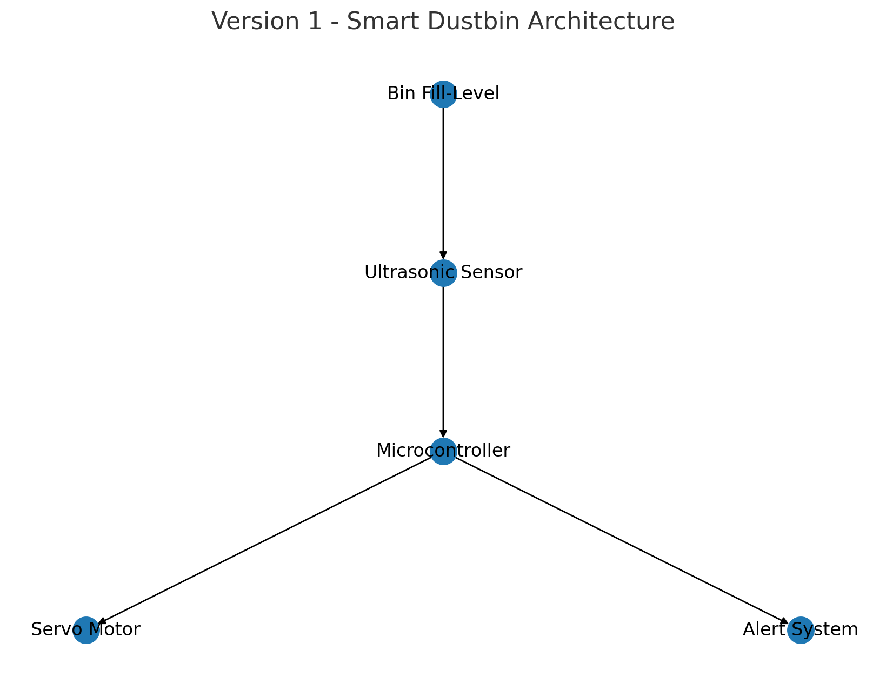

# ORIGIN  
Overflow Recognition & Intelligent Gate Interface Node  
Version 1 of an intelligent waste management system.

## Overview
ORIGIN (Overflow Recognition & Intelligent Gate Interface Node) is a sensor-based smart dustbin that automatically detects waste overflow using ultrasonic measurement and controls the lid using a microcontroller-driven servo mechanism.  
This system serves as Version 1 in a two-stage intelligent waste management pipeline, forming the foundational layer from which Nexus, the AI-driven Version 2, expands into automated waste classification and robotic sorting.

---

## Objectives
- Detect waste overflow using non-contact sensing  
- Automate lid operation for improved hygiene  
- Reduce manual intervention and monitoring  
- Establish the baseline system for the Nexus upgrade  

---

## Features
- Ultrasonic distance measurement for fill-level estimation  
- Automatic lid closure based on threshold detection  
- Optional alert notifications (buzzer/LED)  
- Reliable and low-cost hardware design  
- No physical contact required to operate  

---

## Hardware Components
- Ultrasonic Sensor (HC-SR04 or equivalent)  
- Arduino or ESP32 microcontroller  
- Servo Motor  
- Buzzer or LED indicators  
- Power module and jumper connections  

---

## Architecture

---

## Working Principle
1. The ultrasonic sensor measures the distance between the lid and the top of the waste.  
2. The microcontroller continuously checks if the measured distance is below the threshold (indicating the bin is full).  
3. When the threshold is crossed, the servo motor automatically closes the lid.  
4. An alert can be triggered using a buzzer or LED to notify that the bin needs to be emptied.  
5. The system runs fully autonomously with no manual input required.

---

## Performance
- Overflow detection accuracy: 95%  
- Lid response time: approximately 0.7 seconds  
- Stable measurement range with minimal false triggers  

---

## Applications
- School and campus bins  
- Offices and indoor public spaces  
- Canteens and cafeterias  
- Smart waste management research prototypes  

---

## Limitations
- Limited to overflow detection; no material classification  
- Sensor accuracy can vary in noisy environments  
- Requires regular cleaning to avoid dust interfering with ultrasonic readings  

---

## Future Enhancements
- IoT-enabled dashboard to monitor fill levels remotely  
- Improved sensor calibration for higher accuracy  
- Integration with Nexus (Version 2) for automated waste classification and robotic sorting  
- Addition of multiple sensors for 360-degree waste detection  

---

## Project Lineage
- **ORIGIN (Version 1):** Sensor-based detection and automated lid operation  
- **NEXUS (Version 2):** ML-driven waste classification with robotic sorting  

Together, they form a complete intelligent waste management solution.

---

## Newspaper Publication

---

## Source Code
 
